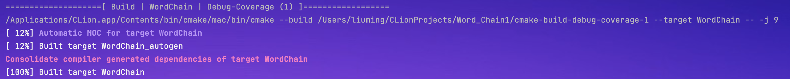
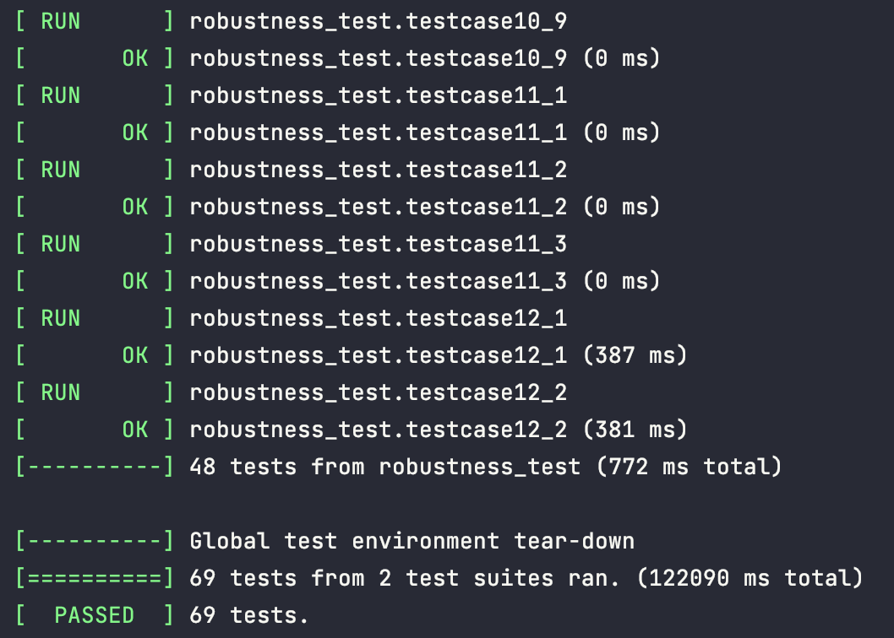
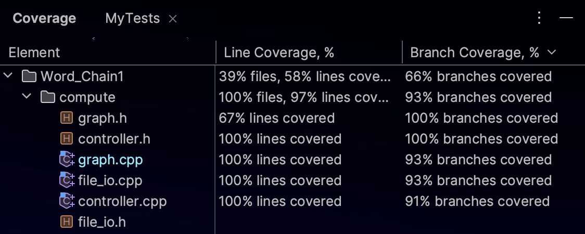

| 项目                                     | 内容                                                         |
| :--------------------------------------- | :----------------------------------------------------------- |
| 这个作业属于哪个课程                     | [2022 年北航敏捷软件工程](https://bbs.csdn.net/forums/buaa-ase2023) |
| 这个作业的要求在哪里                     | [结对编程项目-最长英语单词链](https://bbs.csdn.net/topics/613883108) |
| 我在这个课程的目标是                     | 了解并体验软件工程，实现从「程序」到「软件」的进展。         |
| 这个作业在哪个**具体方面**帮助我实现目标 | 体验结对编程，初步实践工程化开发。                           |

### 教学班级及项目地址

> - 教学班级：周四班
> - 项目地址：https://github.com/seeeagull/Word_Chain

### [res]PSP表格-预期

> 在开始实现程序之前，在下述 PSP 表格记录下你估计将在程序的 各个模块的开发上耗费的时间。

ljc

| **PSP2.1**                              | **Personal Software Process Stages**    | **预估耗时（分钟）** |
| :-------------------------------------- | :-------------------------------------- | :------------------- |
| Planning                                | 计划                                    | 60                   |
| · Estimate                              | · 估计这个任务需要多少时间              | 10                   |
| Development                             | 开发                                    | 2200                 |
| · Analysis                              | · 需求分析 (包括学习新技术)             | 120                  |
| · Design Spec                           | · 生成设计文档                          | 60                   |
| · Design Review                         | · 设计复审 (和同事审核设计文档)         | 250                  |
| · Coding Standard                       | · 代码规范 (为目前的开发制定合适的规范) | 60                   |
| · Design                                | · 具体设计                              | 140                  |
| · Coding                                | · 具体编码                              | 720                  |
| · Code Review                           | · 代码复审                              | 360                  |
| · Test                                  | · 测试 (自我测试，修改代码，提交修改)   | 490                  |
| Reporting                               | 报告                                    | 160                  |
| · Test Report                           | · 测试报告                              | 60                   |
| · Size Measurement                      | · 计算工作量                            | 20                   |
| · Postmortem & Process Improvement Plan | · 事后总结, 并提出过程改进计划          | 80                   |
|                                         | 合计                                    | 2420                 |

jyz todo

| **PSP2.1**                              | **Personal Software Process Stages**    | **预估耗时（分钟）** |
| :-------------------------------------- | :-------------------------------------- | :------------------- |
| Planning                                | 计划                                    |                      |
| · Estimate                              | · 估计这个任务需要多少时间              |                      |
| Development                             | 开发                                    |                      |
| · Analysis                              | · 需求分析 (包括学习新技术)             |                      |
| · Design Spec                           | · 生成设计文档                          |                      |
| · Design Review                         | · 设计复审 (和同事审核设计文档)         |                      |
| · Coding Standard                       | · 代码规范 (为目前的开发制定合适的规范) |                      |
| · Design                                | · 具体设计                              |                      |
| · Coding                                | · 具体编码                              |                      |
| · Code Review                           | · 代码复审                              |                      |
| · Test                                  | · 测试 (自我测试，修改代码，提交修改)   |                      |
| Reporting                               | 报告                                    |                      |
| · Test Report                           | · 测试报告                              |                      |
| · Size Measurement                      | · 计算工作量                            |                      |
| · Postmortem & Process Improvement Plan | · 事后总结, 并提出过程改进计划          |                      |
|                                         | 合计                                    |                      |

### [res]设计理念

> 看教科书和其它资料中关于 Information Hiding，Interface Design，Loose Coupling 的章节，说明你们在结对编程中是如何利用这些方法对接口进行设计的。

ljc

- **信息隐藏(Infromation Hiding)：**信息隐藏类似封装，将对象内部的操作封装使对对象的操作只需要考虑对象之间的关系，而不用关注具体实现细节。也有观点认为信息隐藏主要应用于将变化较多的模块与其他模块分隔开，保证每次修改集中于变化较多的模块即可。

    我们依据这个原则将模块分成了负责文件IO的IO模块、负责图算法的graph模块、负责处理参数的controller模块，每个对象的数据都进行了隐藏和保护，只保留了供外接调用的接口，保证用户无法直接获取修改数据，提高了程序的安全性。

- **接口设计(Interface Design)：**

    - 功能正交：我们根据不同的功能模块划分了若干个正交类，每个类中的方法也尽量保证正交性。
    - 命名规范：我们遵循了google的命名规范https://google.github.io/styleguide/cppguide.html
    - 异常处理：对于接口中可能出现的异常，我们提供了明确的异常处理机制保证使用者能够正确处理异常，保证程序的稳定性和可靠性。

- **松耦合(loose coupling)：**指模块上功能的正交性，这一点在上文信息隐藏部分已经提及，保证我们修改模块时待修改的全集最小化。

jyz todo

- **信息隐藏(Infromation Hiding)：**
- **接口设计(Interface Design)：**
- **松耦合(loose coupling)：**

### 计算模块接口的设计与实现过程

> jyz todo 设计包括代码如何组织，比如会有几个类，几个函数，他们之间关系如何，关键函数是否需要画出流程图？说明你的算法的关键（不必列出源代码），以及独到之处。

### 开发环境下编译通过无警告



### [res]UML图

> todo 阅读有关 UML 的内容，画出 UML 图显示计算模块部分各个实体之间的关系（画一个图即可）https://en.wikipedia.org/wiki/Unified_Modeling_Language

ljc

jyz

### 计算模块接口部分的性能改进

> jyz todo 记录在改进计算模块性能上所花费的时间，并展示你程序中消耗最大的函数，陈述你的性能改进策略。

### [res]关于Design by Contract / Code Contract的思考

> todo 阅读 Design by Contract，Code Contract 的内容，并描述这些做法的优缺点，说明你是如何把它们融入结对作业中的。
>
> * http://en.wikipedia.org/wiki/Design_by_contract
> * http://msdn.microsoft.com/en-us/devlabs/dd491992.aspx

ljc

契约式编程关注前置条件、后置条件、不变式，前置条件描述方法传入参数应当满足一定的规范；后置条件描述经过函数/方法后将产生什么效果；不变式描述在程序运行过程中需要保证的不变内容。优点在于可以进行更多规范，消除兼容性问题；缺点在于实现过程中保证前束范式需要assert，assert本身如何进行、assert失败后行为是什么都需进行考量。

我们实现中在controller里进行了参数异常处理，如果参数异常将返回对应的异常码而非直接抛出异常终止程序。这种做法可以让用户获知错误并纠正行为。

### 单元测试

> todo **计算模块部分单元测试展示。\**\*\*展示出项目部分单元测试代码，并说明测试的函数，构造测试数据的思路。并\*\**\*将单元测试得到的测试覆盖率截图**，发表在博客中。要求总体覆盖率到 90% 以上，否则单元测试部分视作无效。

测试使用了1.12.1版本的google gtest，分为正确性测试、鲁棒性测试两部分。我们共构造有不同特征的12个testcase.txt，21种测试参数组合，分别针对合法参数、非法参数、有环场景来设计正确性测试。对于鲁棒性测试，我们共设计了12种异常，48组测试参数进行测试。



我们的dll文件调用的所有代码被包含在./compute路径下，因此可以用该文件夹下的覆盖率表示该接口的单元测试覆盖率。我们使用clion整合的gcov进行测试覆盖率分析，行覆盖率达到97%，分支覆盖率达到了92%。



#### 正确性测试

| testcase | 自环 | 环   | 长为1单词 | 重复单词 | 混淆字符 | 数据合法性 | 描述                         | 测试参数                                                     |
| -------- | ---- | ---- | --------- | -------- | -------- | ---------- | ---------------------------- | ------------------------------------------------------------ |
| 1        | 有   | 无   | 无        | 无       | 无       | 合法       | 图中只有自环                 | [-n]                                                         |
| 2        | 有   | 有   | 有        | 有       | 有       | 合法       | 测试中文字符、希腊字母       | \[-r -w -h C -j V][-c -r -j h -t J]                          |
| 3        | 有   | 无   | 有        | 有       | 有       | 合法       | 自环在最长链首               | \[-w]                                                        |
| 4        | 有   | 无   | 有        | 有       | 有       | 合法       | 自环在最长链尾               | [-c]\[-c -h a -t a -j b]\[-c -h a -j b]\[-c -h a]\[-c -t a]  |
| 5        | 无   | 有   | 无        | 有       | 无       | 合法       | 最长链有多个环               | [-c  -j h -r]\[-w -h a -t a -r][-w -t a -j b -r]\[-w -h a -t a -j z -r] |
| 6        | 无   | 有   | 无        | 有       | 无       | 合法       | 多个孤立环/链                | [-w -t t -r]\[-w -h n -r]                                    |
| 7        | 有   | 有   | 有        | 有       | 有       | 合法       | 有自环的完全图               | [-w -r]\[-w -t b -r]                                         |
| 8        | 有   | 有   | 无        | 有       | 有       | 合法       | 只有一个环，每个单词都有自环 | [-c -r]                                                      |
| 9        | 有   | 有   | 有        | 有       | 有       | 合法       | 平平无奇                     | [-c -h j -t z -r]                                            |
| 10       | 无   | 无   | 无        | 无       | 无       | 合法       | 只有一个单词，长度很长       | [-w -j b]                                                    |
| 11       |      |      |           |          |          | 不合法     | 非txt文件                    |                                                              |
| 12       |      |      |           |          |          | 合法       | 文件不含单词                 | [-n]                                                         |
| 13       | 有   | 有   | 有        | 无       | 无       | 不合法     | 输出结果有20001个单词        |                                                              |

正确性参数见上表测试参数一列。部分testcase代码如下。

```c++
TEST(correctness_test, testcase1) {
    const char *file_name = "../testcase/testcase1.txt";
    const char *argv[] = {"Wordlist.exe", "-n", file_name};
    WordChain word_chain((std::string(file_name)));
    word_chain.BuildGraph();
    int std_res = word_chain.GetChainCnt();
    word_chain.OutputFile("../output/output1_std.txt");
    int res;
    int ret = controller.Cmd(sizeof(argv) / sizeof(argv[0]), const_cast<char **>(argv), &res, "../output/output1.txt");
    EXPECT_EQ(ret, 0);
    EXPECT_EQ(res, std_res);
}

TEST(correctness_test, testcase2_1) {
    const char *file_name = "../testcase/testcase2.txt";
    const char *argv[] = {"Wordlist.exe", "-r", "-h", "c", "-j", "v", "-w", file_name};
    WordChain word_chain((std::string(file_name)));
    word_chain.BuildGraph();
    int std_res = word_chain.GetMostWordChain('c', '0', 'v');
    word_chain.OutputFile("../output/output2_1_std.txt");
    int res;
    int ret = controller.Cmd(sizeof(argv) / sizeof(argv[0]), const_cast<char **>(argv), &res,
                             "../output/output2_1.txt");
    EXPECT_EQ(ret, 0);
    EXPECT_EQ(res, std_res);
}

TEST(correctness_test, testcase2_2) {
    const char *file_name = "../testcase/testcase2.txt";
    const char *argv[] = {"Wordlist.exe", "-r", "-j", "h", "-t", "j", "-c", file_name};
    WordChain word_chain((std::string(file_name)));
    word_chain.BuildGraph();
    int std_res = word_chain.GetMostCharChain('0', 'j', 'h');
    word_chain.OutputFile("../output/output2_2_std.txt");
    int res;
    int ret = controller.Cmd(sizeof(argv) / sizeof(argv[0]), const_cast<char **>(argv), &res,
                             "../output/output2_2.txt");
    EXPECT_EQ(ret, 0);
    EXPECT_EQ(res, std_res);
}
```

#### 鲁棒性测试

见下文异常处理部分。

### 异常处理

我们共支持了以下12种异常，每一种异常都进行了充分的单元测试。

| case | intsr                                       | 场景                         | expcode             |
| ---- | ------------------------------------------- | ---------------------------- | ------------------- |
| 1    | Wordlist.exe -n                             | 参数中没有文件               | NO_FILE_PATH        |
| 2    | Wordlist.exe -n testcase1.txt testcase2.txt | 参数中多个文件               | MULTI_FILE_PATH     |
| 3    | Wordlist.exe -n testcase0.txt               | 参数中文件不存在             | FILE_NOT_EXISTS     |
| 4    | Wordlist.exe -n testcase11.c                | 参数中文件不是txt文件        | FILE_TYPE_ERROR     |
| 5    | Wordlist.exe -q testcase1.txt               | 非法参数                     | ILLEGAL_PARAM       |
| 6    | Wordlist.exe -h a -t s testcase1.txt        | 无功能性参数                 | NO_FUNCTIONAL_PARAM |
| 7    | Wordlist.exe -n -w testcase1.txt            | 参数冲突                     | PARAMS_CONFLICT     |
| 8    | Wordlist.exe -w -w  testcase1.txt           | 多次指定相同参数             | DUPLICATE_PARAM     |
| 9    | Wordlist.exe -h                             | -h -t -j参数没有接字符串     | CHAR_NOT_ASSIGN     |
| 10   | Wordlist.exe -h AB                          | -h -t -j参数接的字符串不合法 | ILLEGAL_CHAR        |
| 11   | Wordlist.exe -w testcase5.txt               | 未指定-r但出现环             | UNEXPECTED_LOOP     |
| 12   | Wordlist.exe -w testcase13.txt              | 输出单词数超过20000          | LENGTH_OVERFLOW     |

对应的testcase代码如下。

```c++
TEST(robustness_test, testcase1) {
    const char *argv[] = {"Wordlist.exe", "-n"};
    Controller controller{};
    int res;
    int ret = controller.Cmd(sizeof(argv) / sizeof(argv[0]), const_cast<char **>(argv), &res, "../exp1.txt");
    EXPECT_EQ(ret, kNoFilePath);
}

TEST(robustness_test, testcase2_1) {
    const char *argv[] = {"Wordlist.exe", "-n", "../testcase/testcase2.txt", "../testcase/testcase2.txt"};
    Controller controller{};
    int res;
    int ret = controller.Cmd(sizeof(argv) / sizeof(argv[0]), const_cast<char **>(argv), &res, "../exp2_1.txt");
    EXPECT_EQ(ret, kMultiFilePath);
}

TEST(robustness_test, testcase2_2) {
    const char *argv[] = {"Wordlist.exe", "-w", "../testcase/testcase2.txt", "../testcase/testcase2.txt"};
    Controller controller{};
    int res;
    int ret = controller.Cmd(sizeof(argv) / sizeof(argv[0]), const_cast<char **>(argv), &res, "../exp2_2.txt");
    EXPECT_EQ(ret, kMultiFilePath);
}

TEST(robustness_test, testcase2_3) {
    const char *argv[] = {"Wordlist.exe", "-c", "../testcase/testcase2.txt", "../testcase/testcase2.txt"};
    Controller controller{};
    int res;
    int ret = controller.Cmd(sizeof(argv) / sizeof(argv[0]), const_cast<char **>(argv), &res, "../exp2_3.txt");
    EXPECT_EQ(ret, kMultiFilePath);
}

TEST(robustness_test, testcase3_1) {
    const char *argv[] = {"Wordlist.exe", "-n", "../testcase/testcase0.txt"};
    Controller controller{};
    int res;
    int ret = controller.Cmd(sizeof(argv) / sizeof(argv[0]), const_cast<char **>(argv), &res, "../exp3_1.txt");
    EXPECT_EQ(ret, kFileNotExists);
}

TEST(robustness_test, testcase3_2) {
    const char *argv[] = {"Wordlist.exe", "-w", "../testcase/testcase0.txt"};
    Controller controller{};
    int res;
    int ret = controller.Cmd(sizeof(argv) / sizeof(argv[0]), const_cast<char **>(argv), &res, "../exp3_2.txt");
    EXPECT_EQ(ret, kFileNotExists);
}

TEST(robustness_test, testcase3_3) {
    const char *argv[] = {"Wordlist.exe", "-c", "../testcase/testcase0.txt"};
    Controller controller{};
    int res;
    int ret = controller.Cmd(sizeof(argv) / sizeof(argv[0]), const_cast<char **>(argv), &res, "../exp3_3.txt");
    EXPECT_EQ(ret, kFileNotExists);
}

TEST(robustness_test, testcase4_1) {
    const char *argv[] = {"Wordlist.exe", "-n", "../testcase/testcase11.c"};
    Controller controller{};
    int res;
    int ret = controller.Cmd(sizeof(argv) / sizeof(argv[0]), const_cast<char **>(argv), &res, "../exp4_1.txt");
    EXPECT_EQ(ret, kFileTypeError);
}

TEST(robustness_test, testcase4_2) {
    const char *argv[] = {"Wordlist.exe", "-w", "../testcase/testcase11.c"};
    Controller controller{};
    int res;
    int ret = controller.Cmd(sizeof(argv) / sizeof(argv[0]), const_cast<char **>(argv), &res, "../exp4_2.txt");
    EXPECT_EQ(ret, kFileTypeError);
}

TEST(robustness_test, testcase4_3) {
    const char *argv[] = {"Wordlist.exe", "-c", "../testcase/testcase11.c"};
    Controller controller{};
    int res;
    int ret = controller.Cmd(sizeof(argv) / sizeof(argv[0]), const_cast<char **>(argv), &res, "../exp4_3.txt");
    EXPECT_EQ(ret, kFileTypeError);
}

TEST(robustness_test, testcase4_4) {
    const char *argv[] = {"Wordlist.exe", "-n", "t.c"};
    Controller controller{};
    int res;
    int ret = controller.Cmd(sizeof(argv) / sizeof(argv[0]), const_cast<char **>(argv), &res, "../exp4_4.txt");
    EXPECT_EQ(ret, kFileTypeError);
}

TEST(robustness_test, testcase4_5) {
    const char *argv[] = {"Wordlist.exe", "-n", "t.c"};
    Controller controller{};
    int res;
    int ret = controller.Cmd(sizeof(argv) / sizeof(argv[0]), const_cast<char **>(argv), &res, "../exp4_5.txt");
    EXPECT_EQ(ret, kFileTypeError);
}

TEST(robustness_test, testcase4_6) {
    const char *argv[] = {"Wordlist.exe", "-n", "t.c"};
    Controller controller{};
    int res;
    int ret = controller.Cmd(sizeof(argv) / sizeof(argv[0]), const_cast<char **>(argv), &res, "../exp4_6.txt");
    EXPECT_EQ(ret, kFileTypeError);
}

TEST(robustness_test, testcase5_1) {
    const char *argv[] = {"Wordlist.exe", "-q", "../testcase/testcase1.txt"};
    Controller controller{};
    int res;
    int ret = controller.Cmd(sizeof(argv) / sizeof(argv[0]), const_cast<char **>(argv), &res, "../exp5_1.txt");
    EXPECT_EQ(ret, kIllegalParam);
}

TEST(robustness_test, testcase5_2) {
    const char *argv[] = {"Wordlist.exe", "-r", "a", "-n", "../testcase/testcase1.txt"};
    Controller controller{};
    int res;
    int ret = controller.Cmd(sizeof(argv) / sizeof(argv[0]), const_cast<char **>(argv), &res, "../exp5_2.txt");
    EXPECT_EQ(ret, kIllegalParam);
}

TEST(robustness_test, testcase5_3) {
    const char *argv[] = {"Wordlist.exe",  "a", "-n", "../testcase/testcase1.txt"};
    Controller controller{};
    int res;
    int ret = controller.Cmd(sizeof(argv) / sizeof(argv[0]), const_cast<char **>(argv), &res, "../exp5_3.txt");
    EXPECT_EQ(ret, kIllegalParam);
}

TEST(robustness_test, testcase6_1) {
    const char *argv[] = {"Wordlist.exe", "-h", "a", "-t", "s", "../testcase/testcase1.txt"};
    Controller controller{};
    int res;
    int ret = controller.Cmd(sizeof(argv) / sizeof(argv[0]), const_cast<char **>(argv), &res, "../exp6_1.txt");
    EXPECT_EQ(ret, kNoFunctionalParam);
}

TEST(robustness_test, testcase6_2) {
    const char *argv[] = {"Wordlist.exe", "../testcase/testcase1.txt"};
    Controller controller{};
    int res;
    int ret = controller.Cmd(sizeof(argv) / sizeof(argv[0]), const_cast<char **>(argv), &res, "../exp6_2.txt");
    EXPECT_EQ(ret, kNoFunctionalParam);
}

TEST(robustness_test, testcase6_3) {
    const char *argv[] = {"Wordlist.exe", "-h", "a", "-j", "s", "../testcase/testcase1.txt"};
    Controller controller{};
    int res;
    int ret = controller.Cmd(sizeof(argv) / sizeof(argv[0]), const_cast<char **>(argv), &res, "../exp6_3.txt");
    EXPECT_EQ(ret, kNoFunctionalParam);
}

TEST(robustness_test, testcase7_1) {
    const char *argv[] = {"Wordlist.exe", "-w", "../testcase/testcase1.txt", "-n"};
    Controller controller{};
    int res;
    int ret = controller.Cmd(sizeof(argv) / sizeof(argv[0]), const_cast<char **>(argv), &res, "../exp7_1.txt");
    EXPECT_EQ(ret, kParamsConflict);
}

TEST(robustness_test, testcase7_2) {
    const char *argv[] = {"Wordlist.exe", "-c", "../testcase/testcase1.txt", "-n"};
    Controller controller{};
    int res;
    int ret = controller.Cmd(sizeof(argv) / sizeof(argv[0]), const_cast<char **>(argv), &res, "../exp7_2.txt");
    EXPECT_EQ(ret, kParamsConflict);
}

TEST(robustness_test, testcase7_3) {
    const char *argv[] = {"Wordlist.exe", "-n", "../testcase/testcase1.txt", "-w"};
    Controller controller{};
    int res;
    int ret = controller.Cmd(sizeof(argv) / sizeof(argv[0]), const_cast<char **>(argv), &res, "../exp7_3.txt");
    EXPECT_EQ(ret, kParamsConflict);
}

TEST(robustness_test, testcase7_4) {
    const char *argv[] = {"Wordlist.exe", "-c", "../testcase/testcase1.txt", "-w"};
    Controller controller{};
    int res;
    int ret = controller.Cmd(sizeof(argv) / sizeof(argv[0]), const_cast<char **>(argv), &res, "../exp7_4.txt");
    EXPECT_EQ(ret, kParamsConflict);
}

TEST(robustness_test, testcase7_5) {
    const char *argv[] = {"Wordlist.exe", "-n", "../testcase/testcase1.txt", "-c"};
    Controller controller{};
    int res;
    int ret = controller.Cmd(sizeof(argv) / sizeof(argv[0]), const_cast<char **>(argv), &res, "../exp7_5.txt");
    EXPECT_EQ(ret, kParamsConflict);
}

TEST(robustness_test, testcase7_6) {
    const char *argv[] = {"Wordlist.exe", "-w", "../testcase/testcase1.txt", "-c"};
    Controller controller{};
    int res;
    int ret = controller.Cmd(sizeof(argv) / sizeof(argv[0]), const_cast<char **>(argv), &res, "../exp7_6.txt");
    EXPECT_EQ(ret, kParamsConflict);
}

TEST(robustness_test, testcase7_7) {
    const char *argv[] = {"Wordlist.exe", "-n", "../testcase/testcase1.txt", "-h", "h"};
    Controller controller{};
    int res;
    int ret = controller.Cmd(sizeof(argv) / sizeof(argv[0]), const_cast<char **>(argv), &res, "../exp7_7.txt");
    EXPECT_EQ(ret, kParamsConflict);
}

TEST(robustness_test, testcase7_8) {
    const char *argv[] = {"Wordlist.exe", "-n", "../testcase/testcase1.txt", "-t", "h"};
    Controller controller{};
    int res;
    int ret = controller.Cmd(sizeof(argv) / sizeof(argv[0]), const_cast<char **>(argv), &res, "../exp7_8.txt");
    EXPECT_EQ(ret, kParamsConflict);
}

TEST(robustness_test, testcase7_9) {
    const char *argv[] = {"Wordlist.exe", "-n", "../testcase/testcase1.txt", "-j", "h"};
    Controller controller{};
    int res;
    int ret = controller.Cmd(sizeof(argv) / sizeof(argv[0]), const_cast<char **>(argv), &res, "../exp7_9.txt");
    EXPECT_EQ(ret, kParamsConflict);
}

TEST(robustness_test, testcase8_1) {
    const char *argv[] = {"Wordlist.exe", "-n", "../testcase/testcase1.txt", "-n"};
    Controller controller{};
    int res;
    int ret = controller.Cmd(sizeof(argv) / sizeof(argv[0]), const_cast<char **>(argv), &res, "../exp8_1.txt");
    EXPECT_EQ(ret, kDuplicateParam);
}

TEST(robustness_test, testcase8_2) {
    const char *argv[] = {"Wordlist.exe", "-w", "../testcase/testcase1.txt", "-w"};
    Controller controller{};
    int res;
    int ret = controller.Cmd(sizeof(argv) / sizeof(argv[0]), const_cast<char **>(argv), &res, "../exp8_2.txt");
    EXPECT_EQ(ret, kDuplicateParam);
}

TEST(robustness_test, testcase8_3) {
    const char *argv[] = {"Wordlist.exe", "-c", "../testcase/testcase1.txt", "-c"};
    Controller controller{};
    int res;
    int ret = controller.Cmd(sizeof(argv) / sizeof(argv[0]), const_cast<char **>(argv), &res, "../exp8_3.txt");
    EXPECT_EQ(ret, kDuplicateParam);
}

TEST(robustness_test, testcase9_1) {
    const char *argv[] = {"Wordlist.exe", "-h", "-n", "../testcase/testcase1.txt"};
    Controller controller{};
    int res;
    int ret = controller.Cmd(sizeof(argv) / sizeof(argv[0]), const_cast<char **>(argv), &res, "../exp9_1.txt");
    EXPECT_EQ(ret, kCharNotAssign);
}

TEST(robustness_test, testcase9_2) {
    const char *argv[] = {"Wordlist.exe", "-t", "-n", "../testcase/testcase1.txt"};
    Controller controller{};
    int res;
    int ret = controller.Cmd(sizeof(argv) / sizeof(argv[0]), const_cast<char **>(argv), &res, "../exp9_2.txt");
    EXPECT_EQ(ret, kCharNotAssign);
}

TEST(robustness_test, testcase9_3) {
    const char *argv[] = {"Wordlist.exe", "-j", "-n", "../testcase/testcase1.txt"};
    Controller controller{};
    int res;
    int ret = controller.Cmd(sizeof(argv) / sizeof(argv[0]), const_cast<char **>(argv), &res, "../exp9_3.txt");
    EXPECT_EQ(ret, kCharNotAssign);
}

TEST(robustness_test, testcase10_1) {
    const char *argv[] = {"Wordlist.exe", "-h", "AB", "-n", "../testcase/testcase1.txt"};
    Controller controller{};
    int res;
    int ret = controller.Cmd(sizeof(argv) / sizeof(argv[0]), const_cast<char **>(argv), &res, "../exp10_1.txt");
    EXPECT_EQ(ret, kIllegalChar);
}

TEST(robustness_test, testcase10_2) {
    const char *argv[] = {"Wordlist.exe", "-t", "AB", "-n", "../testcase/testcase1.txt"};
    Controller controller{};
    int res;
    int ret = controller.Cmd(sizeof(argv) / sizeof(argv[0]), const_cast<char **>(argv), &res, "../exp10_2.txt");
    EXPECT_EQ(ret, kIllegalChar);
}

TEST(robustness_test, testcase10_3) {
    const char *argv[] = {"Wordlist.exe", "-j", "AB", "-n", "../testcase/testcase1.txt"};
    Controller controller{};
    int res;
    int ret = controller.Cmd(sizeof(argv) / sizeof(argv[0]), const_cast<char **>(argv), &res, "../exp10_3.txt");
    EXPECT_EQ(ret, kIllegalChar);
}

TEST(robustness_test, testcase10_4) {
    const char *argv[] = {"Wordlist.exe", "-h", "1", "../testcase/testcase1.txt"};
    Controller controller{};
    int res;
    int ret = controller.Cmd(sizeof(argv) / sizeof(argv[0]), const_cast<char **>(argv), &res, "../exp10_4.txt");
    EXPECT_EQ(ret, kIllegalChar);
}

TEST(robustness_test, testcase10_5) {
    const char *argv[] = {"Wordlist.exe", "-t", "1", "../testcase/testcase1.txt"};
    Controller controller{};
    int res;
    int ret = controller.Cmd(sizeof(argv) / sizeof(argv[0]), const_cast<char **>(argv), &res, "../exp10_5.txt");
    EXPECT_EQ(ret, kIllegalChar);
}

TEST(robustness_test, testcase10_6) {
    const char *argv[] = {"Wordlist.exe", "-j", "1", "../testcase/testcase1.txt"};
    Controller controller{};
    int res;
    int ret = controller.Cmd(sizeof(argv) / sizeof(argv[0]), const_cast<char **>(argv), &res, "../exp10_6.txt");
    EXPECT_EQ(ret, kIllegalChar);
}

TEST(robustness_test, testcase10_7) {
    const char *argv[] = {"Wordlist.exe", "-h", "a", "a", "../testcase/testcase1.txt"};
    Controller controller{};
    int res;
    int ret = controller.Cmd(sizeof(argv) / sizeof(argv[0]), const_cast<char **>(argv), &res, "../exp10_7.txt");
    EXPECT_EQ(ret, kIllegalChar);
}

TEST(robustness_test, testcase10_8) {
    const char *argv[] = {"Wordlist.exe", "-t", "a", "a", "../testcase/testcase1.txt"};
    Controller controller{};
    int res;
    int ret = controller.Cmd(sizeof(argv) / sizeof(argv[0]), const_cast<char **>(argv), &res, "../exp10_8.txt");
    EXPECT_EQ(ret, kIllegalChar);
}

TEST(robustness_test, testcase10_9) {
    const char *argv[] = {"Wordlist.exe", "-j", "a", "a", "../testcase/testcase1.txt"};
    Controller controller{};
    int res;
    int ret = controller.Cmd(sizeof(argv) / sizeof(argv[0]), const_cast<char **>(argv), &res, "../exp10_9.txt");
    EXPECT_EQ(ret, kIllegalChar);
}

TEST(robustness_test, testcase11_1) {
    const char *argv[] = {"Wordlist.exe", "-n", "../testcase/testcase5.txt"};
    Controller controller{};
    int res;
    int ret = controller.Cmd(sizeof(argv) / sizeof(argv[0]), const_cast<char **>(argv), &res, "../exp11_1.txt");
    EXPECT_EQ(ret, kUnexpectedLoop);
}

TEST(robustness_test, testcase11_2) {
    const char *argv[] = {"Wordlist.exe", "-w", "../testcase/testcase5.txt"};
    Controller controller{};
    int res;
    int ret = controller.Cmd(sizeof(argv) / sizeof(argv[0]), const_cast<char **>(argv), &res, "../exp11_2.txt");
    EXPECT_EQ(ret, kUnexpectedLoop);
}

TEST(robustness_test, testcase11_3) {
    const char *argv[] = {"Wordlist.exe", "-c", "../testcase/testcase5.txt"};
    Controller controller{};
    int res;
    int ret = controller.Cmd(sizeof(argv) / sizeof(argv[0]), const_cast<char **>(argv), &res, "../exp11_3.txt");
    EXPECT_EQ(ret, kUnexpectedLoop);
}


TEST(robustness_test, testcase12_1) {
    const char *argv[] = {"Wordlist.exe", "-r", "-w", "../testcase/testcase13.txt"};
    Controller controller{};
    int res;
    int ret = controller.Cmd(sizeof(argv) / sizeof(argv[0]), const_cast<char **>(argv), &res, "../exp12_1.txt");
    EXPECT_EQ(ret, kLengthOverflow);
}

TEST(robustness_test, testcase12_2) {
    const char *argv[] = {"Wordlist.exe", "-r", "-c", "../testcase/testcase13.txt"};
    Controller controller{};
    int res;
    int ret = controller.Cmd(sizeof(argv) / sizeof(argv[0]), const_cast<char **>(argv), &res, "../exp12_2.txt");
    EXPECT_EQ(ret, kLengthOverflow);
}
```

### UI设计

界面模块采用C++的Qt6实现，整体效果如下：

- macos运行实例

    

- windows运行实例

    todo 图片

#### UI布局及使用流程

UI分成两个部分。上侧用于选择目标功能、进行限制、点击求解、导入待处理txt文件、保存求解结果；下侧分成两部分，左侧用于展示待处理文本，右侧用于展示求解结果。用户使用流程为：

1. 点击“导入”导入txt文件，或者在左侧手动输入待处理数据。待处理数据可以包括非英文字符，按照`单词的定义为：被非英文字符间隔的连续英文字符序列`处理
2. 选择上方功能性参数和中间辅助性参数
3. 点击求解，求解结果将显示在右下方窗口
4. 如需保存求解结果，点击“导出”并在弹出窗口中设置保存文件路径及文件名

#### UI部分实现

##### UI层面添加约束解决异常

| case | intsr                                       | 场景                         | expcode             |
| ---- | ------------------------------------------- | ---------------------------- | ------------------- |
| 1    | Wordlist.exe -n                             | 参数中没有文件               | NO_FILE_PATH        |
| 2    | Wordlist.exe -n testcase1.txt testcase2.txt | 参数中多个文件               | MULTI_FILE_PATH     |
| 3    | Wordlist.exe -n testcase0.txt               | 参数中文件不存在             | FILE_NOT_EXISTS     |
| 4    | Wordlist.exe -n testcase11.c                | 参数中文件不是txt文件        | FILE_TYPE_ERROR     |
| 5    | Wordlist.exe -q testcase1.txt               | 非法参数                     | ILLEGAL_PARAM       |
| 6    | Wordlist.exe -h a -t s testcase1.txt        | 无功能性参数                 | NO_FUNCTIONAL_PARAM |
| 7    | Wordlist.exe -n -w testcase1.txt            | 参数冲突                     | PARAMS_CONFLICT     |
| 8    | Wordlist.exe -w -w  testcase1.txt           | 多次指定相同参数             | DUPLICATE_PARAM     |
| 9    | Wordlist.exe -h                             | -h -t -j参数没有接字符串     | CHAR_NOT_ASSIGN     |
| 10   | Wordlist.exe -h AB                          | -h -t -j参数接的字符串不合法 | ILLEGAL_CHAR        |
| 11   | Wordlist.exe -w testcase5.txt               | 未指定-r但出现环             | UNEXPECTED_LOOP     |
| 12   | Wordlist.exe -r -w testcase13.txt           | 单词数超过20000              | LENGTH_OVERFLOW     |

对异常的处理通常有两种：1. UI进行较少的限制，用户触发异常提示用户重新输入 或2. UI直接进行约束

对大部分异常(expcode = 1, 2, 3, 4, 5, 6, 7, 8, 9, 10)，我们采用了第二种方式添加约束保证用户无法触发；对于需要根据是否形成环路判断的异常(expcode = 11)和需要根据结果数组长度判定的异常(expcode = 12)则采用第一种方式在用户触发异常后提示用户。对各异常的实现如下：

```c++
// expcode=1，参数中没有文件，求解按钮点击后从inputContentTextEdit处读取文件，如果为空则按空文件处理
std::string inputContent = inputContentTextEdit->toPlainText().toStdString();
// expcode=2，参数中多个文件，每次点击导入按钮后将txt文件内容映射到inputContentTextEdit
// expcode=3，参数中文件不存在，点击导入按钮后使用QFileDialog::getOpenFileName弹出对话框筛选文件，无法选择不存在文件
// expcode=4，参数中文件不是txt文件，设置QFileDialog::getOpenFileName的filter参数为"文本文件(*.txt)"，限定选择文件只能是txt文件
QString inputPath = QFileDialog::getOpenFileName(this, dlgTitle, curPath, filter);
  if (!inputPath.isEmpty()) {
      QFile inputFile(inputPath);
      if (!inputFile.open(QIODevice::ReadOnly | QIODevice::Text)) return;
      QTextStream inputContentTextStream(&inputFile);
      QString line = inputContentTextStream.readLine();
      QString inputContent;
      while (!line.isNull()) {
          inputContent.append(line);
          line = inputContentTextStream.readLine();
      }
      inputPathLineEdit->setText(inputPath);
      inputContentTextEdit->setText(inputContent);
  }
// expcode=5，非法参数，只有控制面板的参数可以选择
// expcode=6，无功能性参数，默认选择-w
functionalParamsRadio[1]->setChecked(true);
// expcode=7，参数冲突，功能性参数使用radioButton组，只能选择一个
functionalParamsGroup = new QButtonGroup;
  for (int i = 0; i < NumFunctions; ++i) {
      functionalParamsRadio[i] = new QRadioButton(functions[i]);
      functionalParamsGroup->addButton(functionalParamsRadio[i]);
      layout->addWidget(functionalParamsRadio[i], 0, 4 * i, 1, 4);
  }
// expcode=7，-n不能同时选择-h -t -j -r，设置选择-n时无法选择这四个参数
todo
// expcode=8，多次指定相同参数，UI只有选择与不选择两个状态，没有选择次数
// expcode=9，-h -t -j参数没有接字符串，保证这三个参数后面的选择框要么不选表示未指定，要么输入一个英文字母
// expcode=10，-h -t -j参数接的字符串不合法，通过Regex限定输入字符一定为英文字母
limitChar[i]->setPlaceholderText("允许所有");
          QRegularExpression regex("[a-zA-Z]{1}");
          QValidator *validator = new QRegularExpressionValidator(regex);
          limitChar[i]->setValidator(validator);
// expcode=11，未指定-r但出现环，求解出现环后弹出对话框提示用户
// expcode=12，输出单词数超过20000，求解输出单词过多弹出对话框提示用户
if (ret < 0) {
      if (ret == -kUnexpectedLoop) {
          QMessageBox::information(nullptr, "提示", "输入存在环，请勾选\"允许出现环\"");
      } else if (ret == -kLengthOverflow) {
          QMessageBox::information(nullptr, "提示", "输出单词链过长");
      }
      return;
  }
```

#### UI信号控制事件实现

```c++
void WordChainUI::onInputPathChooseButtonClicked() {
  QString curPath = QDir::currentPath();
  QString dlgTitle = "选择待导入文件";
  QString filter = "文本文件(*.txt)";
  QString inputPath = QFileDialog::getOpenFileName(this, dlgTitle, curPath, filter);
  if (!inputPath.isEmpty()) {
      QFile inputFile(inputPath);
      if (!inputFile.open(QIODevice::ReadOnly | QIODevice::Text)) return;
      QTextStream inputContentTextStream(&inputFile);
      QString line = inputContentTextStream.readLine();
      QString inputContent;
      while (!line.isNull()) {
          inputContent.append(line);
          line = inputContentTextStream.readLine();
      }
      inputPathLineEdit->setText(inputPath);
      inputContentTextEdit->setText(inputContent);
  }
}

void WordChainUI::onSolveButtonClicked() {
  char functionalParam = functionalParamsRadio[0]->isChecked() ? 'n' :
                         functionalParamsRadio[1]->isChecked() ? 'w' :
                         functionalParamsRadio[2]->isChecked() ? 'c' : 0;
  char head = limitChar[0]->text().toStdString().length() > 0 ? tolower(limitChar[0]->text().toStdString()[0]) : 0;
  char tail = limitChar[1]->text().toStdString().length() > 0 ? tolower(limitChar[1]->text().toStdString()[0]) : 0;
  char reject = limitChar[2]->text().toStdString().length() > 0 ? tolower(limitChar[2]->text().toStdString()[0]) : 0;
  bool enable_loop = allowRingsRadio->isChecked();
  char *words[200000];
  char *res[20000];
  std::string inputContent = inputContentTextEdit->toPlainText().toStdString();
  std::string s;
  int len = 0;
  for (int i = 0; i < inputContent.length(); ++i) {
      char c = inputContent[i];
      if (isupper(c)) s += (char) tolower(c);
      else if (islower(c)) s += c;
      else {
          if (s.length() > 0) {
              words[len] = new char[s.length() + 1];
              for (int j = 0; j < s.length(); ++j) {
                  words[len][j] = s[j];
              }
              words[len++][s.length()] = '\0';
              s = "";
          }
      }
  }
  QElapsedTimer timer;
  timer.start();
  int ret;
  switch (functionalParam) {
      case 'n':
          ret = gen_chains_all(words, len, res);
          break;
      case 'w':
          ret = gen_chain_word(words, len, res, head, tail, reject, enable_loop);
          break;
      case 'c':
          ret = gen_chain_char(words, len, res, head, tail, reject, enable_loop);
          break;
      default:
          // never hit here
          ret = -1;
          break;
  }
  qint64 elapsed = timer.nsecsElapsed();
  if (ret < 0) {
      if (ret == -kUnexpectedLoop) {
          QMessageBox::information(nullptr, "提示", "输入存在环，请勾选\"允许出现环\"");
      } else if (ret == -kLengthOverflow) {
          QMessageBox::information(nullptr, "提示", "输出单词链过长");
      }
      return;
  }
  std::string usedTimePrompt = "用时: " + std::to_string(abs(elapsed / 1000)) + "秒";
  QString usedTimePromptQ = QString::fromStdString(usedTimePrompt);
  usedTimeLabel->setText(usedTimePromptQ);
  QStringList strList;
  int i = 0;
  while (res[i] != nullptr) strList << QString(res[i++]);
  QString outputContent = strList.join("\n");
  outputContentTextEdit->setText(outputContent);
}

void WordChainUI::onOutputPathChooseButtonClicked() {
  QString curPath = QDir::currentPath();
  QString dlgTitle = "保存文件";
  QString filter = "文本文件(*.txt)";
  QString outputPath = QFileDialog::getSaveFileName(this, dlgTitle, curPath, filter);
  if (!outputPath.isEmpty()) {
      QFile outputFile(outputPath);
      if (!outputFile.open(QIODevice::ReadWrite)) return;
      QString outputContent = outputContentTextEdit->toPlainText();
      outputFile.write(outputContent.toUtf8());
      outputFile.close();
  }
}
```

### 界面模块与计算模块的对接

> todo 详细地描述 UI 模块的设计与两个模块的对接，并在博客中截图实现的功能。

UI调用

### 结对过程

> todo 提供两人在讨论的结对图像资料（比如 Live Share 的截图）。关于如何远程进行结对参见作业最后的注意事项。

### [res]优缺点

> todo 看教科书和其它参考书，网站中关于结对编程的章节，例如：http://www.cnblogs.com/xinz/archive/2011/08/07/2130332.html ，说明结对编程的优点和缺点。同时描述结对的每一个人的优点和缺点在哪里（要列出至少三个优点和一个缺点）。

- 结对编程优缺点
- jyz优缺点
- ljc优缺点

### [res]PSP表格-实际

todo jyz写自己的

| **PSP2.1**                              | **Personal Software Process Stages**    | **预估耗时（分钟）** | **实际耗时（分钟）** |
| :-------------------------------------- | :-------------------------------------- | :------------------- | :------------------- |
| Planning                                | 计划                                    | 60                   | 60                   |
| · Estimate                              | · 估计这个任务需要多少时间              | 10                   | 10                   |
| Development                             | 开发                                    | 2200                 | 3100                 |
| · Analysis                              | · 需求分析 (包括学习新技术)             | 120                  | 150                  |
| · Design Spec                           | · 生成设计文档                          | 60                   | 100                  |
| · Design Review                         | · 设计复审 (和同事审核设计文档)         | 250                  | 120                  |
| · Coding Standard                       | · 代码规范 (为目前的开发制定合适的规范) | 60                   | 40                   |
| · Design                                | · 具体设计                              | 140                  | 220                  |
| · Coding                                | · 具体编码                              | 720                  | 1460                 |
| · Code Review                           | · 代码复审                              | 360                  | 400                  |
| · Test                                  | · 测试 (自我测试，修改代码，提交修改)   | 490                  | 620                  |
| Reporting                               | 报告                                    | 160                  | 250                  |
| · Test Report                           | · 测试报告                              | 60                   | 140                  |
| · Size Measurement                      | · 计算工作量                            | 20                   | 20                   |
| · Postmortem & Process Improvement Plan | · 事后总结, 并提出过程改进计划          | 80                   | 90                   |
|                                         | 合计                                    | 2420                 | 3410                 |

### 附加-模块松耦合

> todo 在博客中指明合作小组两位同学的学号，分析两组不同的模块合并之后出现的问题，为何会出现这样的问题，以及是如何根据反馈改进自己模块的。


